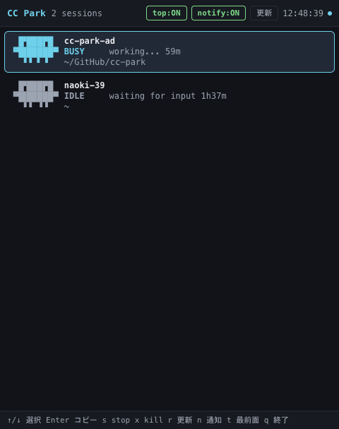

# cc-park

マシン上で稼働中の Claude Code セッションを、キャラクターで一覧表示するツールです。
独自ウィンドウで動くデスクトップ GUI（既定）と、ターミナル TUI（`--cli`）の 2 モードがあります。

一定間隔で `claude agents --json` を実行し、各セッションの状態に応じてキャラクターがアニメーションします。
「作業中」「作業完了」「入力待ち」「承認待ち」が一目で判別できます。

GUI の画面は [GUI モード](#gui-モード) を参照してください。以下は `--cli` で起動した場合の表示です。

```
 CC Park 3 sessions                                      notify:ON 0:51:04

 ~

   ▗▐▛███▛█
 > ▝▜██████▀ claude agents setup [bg]
     ▝▝ ▝▝   BLOCKED  needs your approval 10h39m

 ~/GitHub/cc-park

    ▐▛███▛█
   ▝▜██████▀ cc-park-bd [self]
     ▘▝ ▝▝   BUSY     working... 21m

 ~/GitHub/vscode-ai-coding-sidebar

    ▐▛███▛█
   ▝▜██████▀ vscode-ai-coding-sidebar-3e
     ▝▝ ▝▝   IDLE     waiting for input 37m
```

セッションは**作業ディレクトリごとにまとめて**表示します。

## 必要環境

- Node.js 20 以上
- `claude` コマンド（Claude Code CLI）が PATH に通っていること
- CLI モードの OS 通知とクリップボードコピーは macOS のみ対応
  （GUI モードは Electron の API を使うため OS を問いません）
- GUI モードは Electron を同梱します（`npm install` 時に約 100〜200MB の追加ダウンロードが発生します）

## インストール

```bash
npm install
npm run build
npm link
```

## 使い方

```bash
cc-park          # GUI（独自ウィンドウ）で起動する
cc-park --cli    # ターミナル（TUI）で起動する
```

### オプション

| オプション | 既定値 | 説明 |
| --- | --- | --- |
| `--cli` | なし | ターミナル（CLI/TUI）で起動する |
| `--gui` | 既定 | 独自ウィンドウ（GUI）で起動する |
| `--interval <ms>` | `2000` | ポーリング間隔（下限 500ms） |
| `--all` | CLI: OFF / **GUI: ON** | 完了済みバックグラウンドセッションも表示する |
| `--cwd <path>` | なし | 指定パス配下のバックグラウンドセッションのみ表示する |
| `--no-notify` | 通知 ON | OS 通知を無効化する |
| `--prompt` | CLI: OFF / **GUI: ON** | 最後に与えたプロンプトを表示する |
| `--tokens` | CLI: OFF / **GUI: ON** | コンテキスト利用率を表示する |
| `--context-limit <tokens>` | 自動推定 | コンテキスト上限を明示指定する |
| `--finished-highlight <sec>` | `10` | 作業完了ハイライトの保持秒数 |
| `--once` | なし | 1 回だけ取得して描画し終了する（CLI モード） |

```bash
cc-park --all --cwd ~/GitHub
cc-park --cli --interval 1000 --no-notify
cc-park --cli --prompt --tokens
cc-park --no-prompt --no-tokens          # GUI の既定表示を減らす
```

`--all` / `--prompt` / `--tokens` は **GUI では既定で有効**です。
ウィンドウを開いたまま眺める使い方が主なので、`cc-park` だけで全部入りの表示になります。
端末を占有する CLI ではこれまでどおり OFF から始まるので、必要なときに付けてください。
どちらのモードでも `--no-prompt` のように否定形で個別に切れます。

起動モードは明示したフラグだけで決まります。ランチャーやエディタから起動した場合でも
GUI を開けるよう、標準出力が TTY かどうかは判断材料にしません。
`--once` は CLI 固有の動作なので、単独で指定した場合は CLI モードになります
（`cc-park --once | cat` はこれまでどおりテキストを出力します）。

## CLI モード

`--cli` を付けるとターミナルの TUI で起動します。

```bash
cc-park --cli
```

パイプやリダイレクトなど非 TTY 環境では、自動的に `--once` 相当の動作になります。

### 画面の扱い

対話起動時は **代替スクリーン**（vim や htop と同じ仕組み）で描画します。
再描画のたびに端末のスクロールバックへ出力が流れることがなく、`q` で終了すると元の画面が復元されます。

セッション数が端末の高さに収まらない場合は、選択行を中心に収まる分だけ表示し、
隠れている件数を `^ 他 N 件` / `v 他 N 件` として上下に示します。カーソル移動に追従してスクロールします。

### 並び順とグループ

セッションは**作業ディレクトリ（cwd）ごとにまとめ**、見出しを 1 回だけ出します。

- グループの順番は cwd の昇順（例: `~` → `~/xxx/xxx` → `~/yyy/yyy`）
- グループ内の順番はこれまでどおり `BLOCKED` → `DONE!` → `BUSY` → `IDLE` → `DONE` → `STOPPED` → `UNKNOWN`
- cwd を取得できないセッションは `(不明)` としてまとめ、最後に置きます
- 上下キーはグループをまたいで移動します

### キーバインド

| キー | 動作 |
| --- | --- |
| `↑` / `k` | カーソルを上へ |
| `↓` / `j` | カーソルを下へ |
| `c` | `claude --resume <sessionId>` をクリップボードへコピー |
| `s` | 選択中の background セッションを stop（`y` で確定 / 他キーで取消） |
| `x` | 選択中のセッションのプロセスを kill（`y` で確定 / 他キーで取消） |
| `r` | 即時リフレッシュ |
| `n` | OS 通知の ON / OFF 切り替え |
| `q` / `Ctrl+C` | 終了 |

#### `s`（stop）と `x`（kill）の使い分け

| | `s`（stop） | `x`（kill） |
| --- | --- | --- |
| 対象 | `[bg]` の background セッション | PID を持つ interactive セッション |
| 手段 | `claude stop <id>` | プロセスへ `SIGTERM` を送る |
| 会話 | 残る（`claude attach <id>` で再開） | claude 側の終了処理に委ねられる |

`claude stop` は background セッションにしか使えないため、ターミナルで動いている
interactive セッションを止める手段として `x` を用意しています。対象外のセッションで
押した場合は、確認待ちに入らずもう一方を案内します。

#### `s`（stop）について

- 対象は `[bg]` の background セッションのみ。`claude stop <id>` を実行する
- interactive セッションは `claude stop` が非対応のため弾かれる
- 会話は消えず、`claude attach <id>` で開き直せる
- 誤操作を防ぐため 2 段階確認（`s` → `y`）。確認待ち中の `y` 以外のキーはすべて取消として扱う
- stop 後は state が `stopped` になり、`--all` を付けていない既定の一覧からは消える

#### `x`（kill）について

- 対象は PID を持つセッション（= `claude` が interactive として報告するもの）
- いきなり強制終了せず `SIGTERM` を送る。claude 側に後片付けの余地を残すため
- 誤操作を防ぐため 2 段階確認（`x` → `y`）。確認待ち中の `y` 以外のキーはすべて取消として扱う
- プロセスが既に終了していた場合や権限が無い場合は、理由を添えて失敗を表示する
- `[self]` が付いたセッション（cc-park を起動した自分自身のセッション）も対象になるため、
  確認ダイアログの名前をよく確かめてから実行すること

## 最終プロンプトとコンテキスト利用率

各セッションの**最後に与えたプロンプト**と**コンテキストの利用率**を表示します。
GUI は既定で有効、CLI は `--prompt` / `--tokens` を付けたときに表示します。

```bash
cc-park                      # GUI はこれだけで表示される
cc-park --cli --prompt --tokens
```

```
 CC Park 3 sessions                                                    notify:ON 0:51:04

 ~

 > ▗▐▛███▛█  claude agents setup [bg]                                     ███████░ ctx  92%
   ▝▜██████▀ BLOCKED  needs your approval 10h39m
     ▝▝ ▝▝   > MCP サーバの設定を見直して

 ~/GitHub/cc-park

    ▐▛███▛█  cc-park-bd [self]                                            ██░░░░░░ ctx  27%
   ▝▜██████▀ BUSY     working... 21m
     ▘▝ ▝▝   > キャラクターの足のアニメーションを左右に分けて

 ~/GitHub/vscode-ai-coding-sidebar

    ▐▛███▛█  vscode-ai-coding-sidebar-3e                                  ████░░░░ ctx  45%
   ▝▜██████▀ IDLE     waiting for input 37m
     ▝▝ ▝▝   > サイドバーの折りたたみ状態を保存して
```

| 表示 | 意味 |
| --- | --- |
| `> ...` | そのセッションに最後に与えたプロンプト（約 200 文字で切り詰め）。まだ無い場合は `>` だけ |
| `███░░░░░ ctx  36%` | コンテキストの利用率。`〜69%` は控えめ、`70〜89%` は黄、`90%〜` は赤 |

### 取得元

`claude agents --json` にはどちらも含まれないため、セッションの会話ログから読み取ります。

```
~/.claude/projects/<cwd をエンコードした名前>/<sessionId>.jsonl
```

- 最終プロンプトは `last-prompt` 行、利用率は直近の assistant 応答の `usage` から求めます
- ログは数 MB になるため**末尾 64KB だけ**を読み、更新が無ければ読み直しません
- 会話ログが見つからないセッションは、行の高さを揃えるためプロンプト行に `>` だけを出します

### コンテキスト上限の推定

会話ログには上限が記録されておらず、モデル名からも 1M 版かどうかを判別できません。
そのため**使用量が収まる最小の段**（200k → 1M）を上限とみなします。
実際と食い違う場合は `--context-limit` で明示できます。

```bash
cc-park --cli --tokens --context-limit 200000
```

### 注意

これらは非公開の内部ファイルを読むため、Claude Code 側の変更で取得できなくなる可能性があります。
その場合も一覧表示そのものは止まらず、該当の行だけが 2 行表示に戻ります。

## GUI モード

引数なしの `cc-park` は独自ウィンドウで起動します（`--gui` を明示しても同じです）。

```bash
cc-park
cc-park --gui --interval 1000 --all
```



表示内容・状態遷移・通知・stop・コピーは CLI モードと同じで、取得や停止のロジックも同じコードを共有しています。
GUI では加えて次の操作ができます。

| 操作 | CLI | GUI |
| --- | --- | --- |
| 選択移動 | `↑` `↓` `k` `j` | 同左 ＋ 行クリック |
| resume コマンドをコピー | `c` | 同左 ＋ 行ダブルクリック |
| stop（2 段階確認） | `s` → `y` | 同左 ＋ 確認ダイアログのボタン |
| kill（2 段階確認） | `x` → `y` | 同左 ＋ 確認ダイアログのボタン |
| 確認の取消 | 確認待ち中の `y` 以外のキー | 同左 ＋ `Esc` ＋ 取消ボタン |
| 即時更新 | `r` | 同左 ＋ 更新ボタン |
| 通知 ON / OFF | `n` | 同左 ＋ ヘッダのトグル |
| **最前面に固定** | なし | `t` ＋ ヘッダの `top` トグル（既定 ON） |
| 終了 | `q` `Ctrl+C` | `q` `Cmd+W` `Cmd+Q` |

- ウィンドウは初期 480x640・最小 360x400 でリサイズできます。件数が増えたら一覧側がスクロールします
- OS の外観設定に追従してライト / ダークが切り替わります
- 通知とクリップボードは Electron の API を使うため、`osascript` / `pbcopy` を必要としません

### 最前面に固定する

エディタやターミナルで作業しながらセッションの状態を見張る使い方を想定しているため、
**起動時から最前面に固定された状態** で開きます。

`t` キー、またはヘッダの `top:ON` / `top:off` トグルで固定を解除・再設定できます。

- 切り替えた状態は保存されません。次回もまた固定された状態から始まります
- 実際に固定できたかは OS 側の都合にも左右されるため、表示は main プロセスが適用した結果に追従します

### 制約

- `--gui` と `--once`、`--cli` と `--gui` は併用できません
- 動作確認は macOS のみです（実装上の OS 依存は無く、他 OS でも動作する想定です）
- `.app` / `.dmg` としての配布パッケージはまだ用意していません
- 環境変数 `ELECTRON_RUN_AS_NODE` が設定されていると Electron が素の Node として起動してしまうため、
  `cc-park --gui` は子プロセスの環境からこの変数を取り除いてから Electron を起動します

## 状態とキャラクター

キャラクターは Claude Code の起動バナーと同じマークです。身体（2 行目）は全状態で共通で、
**手・足の動きと色**で状態を表します。

**動かす部位で役割が分かれます。**

| 動く部位 | 状態 | 意味 |
| --- | --- | --- |
| 手 | `BLOCKED` / `DONE!` | こちらの操作を待っている |
| 足 | `BUSY` | 作業中 |

アニメーションするのは `BLOCKED` / `DONE!` / `BUSY` の 3 つだけです。
`IDLE` `DONE` `STOPPED` `UNKNOWN` は静止するので、**動いている行だけを見れば
「作業中」か「こちらの操作待ち」かが分かります**。

### ステータス一覧

一覧は要対応のものが上に来るよう（下表の上から順に）並べ替えられます。
アニメーションの更新間隔は 200ms です。

| 表示 | 色 | 動く部位 | フレーム | 動き | 意味 |
| --- | --- | --- | --- | --- | --- |
| `BLOCKED` | 黄 | 手 | 2 | 右手 ⇄ 下ろす | 承認・入力を待っている（要対応） |
| `DONE!` | 明るい緑 | 手 | 2 | 下ろす ⇄ 両手 | 作業が完了した直後（既定 10 秒間） |
| `BUSY` | シアン | 足 | 8 | 右足 → 左足 の順に開いて閉じる | 作業中 |
| `IDLE` | 灰 | - | 1 | 静止 | 入力待ち |
| `DONE` | 緑 | - | 1 | 静止 | バックグラウンドが完了（`--all`） |
| `STOPPED` | 灰 | - | 1 | 静止 | 停止済み（`--all`） |
| `UNKNOWN` | 赤 | - | 1 | 静止（足が不揃い） | 未知の状態（生の状態文字列を併記） |

動く 3 つは、次のように見分けられます。

| 状態 | 見分け方 |
| --- | --- |
| `BLOCKED` | 右手だけが上下する |
| `DONE!` | 両手が同時に上下する |
| `BUSY` | 手は動かず、右足 → 左足 の順に足が動く |

### ステータスごとのアニメーション

#### `BLOCKED`（承認・入力待ち）

- 状態キー: `blocked` / 色: 黄（`yellow`） / 優先度: 0
- 説明文: `needs your approval`
- 動き: **右手を上げる → 手を下ろす**（2 フレーム / 400ms 周期）

```
▗▐▛███▛█     ▐▛███▛█
▝▜██████▀   ▝▜██████▀
  ▝▝ ▝▝       ▝▝ ▝▝
```

右手だけを上げ下げして呼びます。一覧では最優先で一番上に表示されます。

#### `DONE!`（作業完了直後）

- 状態キー: `justFinished` / 色: 明るい緑（`greenBright`） / 優先度: 1
- 説明文: `just finished - your turn`
- 動き: **手を下ろす → 両手を上げる**（2 フレーム / 400ms 周期）

```
 ▐▛███▛█    ▗▐▛███▛█▗
▝▜██████▀   ▝▜██████▀
  ▝▝ ▝▝       ▝▝ ▝▝
```

**唯一、両手が同時に上がる状態**です。`BUSY` → `IDLE` の遷移から導出される擬似ステートで、
既定 10 秒間だけ表示されます（`--finished-highlight` で変更可能）。

#### `BUSY`（作業中）

- 状態キー: `working` / 色: シアン（`cyan`） / 優先度: 2
- 説明文: `working...`
- 動き: **右足を開く → 標準 → 右足を閉じる → 標準 → 左足を開く → 標準 → 左足を閉じる → 標準**（8 フレーム / 1600ms 周期）

```
 ▐▛███▛█     ▐▛███▛█     ▐▛███▛█     ▐▛███▛█
▝▜██████▀   ▝▜██████▀   ▝▜██████▀   ▝▜██████▀
  ▘▝ ▝▝       ▝▝ ▝▝       ▝▘ ▝▝       ▝▝ ▝▝
右足を開く    標準      右足を閉じる  標準

 ▐▛███▛█     ▐▛███▛█     ▐▛███▛█     ▐▛███▛█
▝▜██████▀   ▝▜██████▀   ▝▜██████▀   ▝▜██████▀
  ▝▝ ▘▝       ▝▝ ▝▝       ▝▝ ▝▘       ▝▝ ▝▝
左足を開く    標準      左足を閉じる  標準
```

**手は下ろしたまま動かしません。** 足は桁 2 / 3（右足）と桁 5 / 6（左足）に 2 本ずつあり、
`▝`（右上）と `▘`（左上）を入れ替えることで半セルぶん踏み出します。

| 足の形 | 3 行目 | 動く桁 |
| --- | --- | --- |
| 標準 | `  ▝▝ ▝▝  ` | - |
| 右足を開く | `  ▘▝ ▝▝  ` | 桁 2 |
| 右足を閉じる | `  ▝▘ ▝▝  ` | 桁 3 |
| 左足を開く | `  ▝▝ ▘▝  ` | 桁 5 |
| 左足を閉じる | `  ▝▝ ▝▘  ` | 桁 6 |

右足 → 左足 の順に動かすことで、左右の足が交互に踏み出しているように見せています。

#### `IDLE`（入力待ち）

- 状態キー: `waiting` / 色: 灰（`gray`） / 優先度: 3
- 説明文: `waiting for input`
- 動き: **静止**（1 フレーム）

```
 ▐▛███▛█
▝▜██████▀
  ▝▝ ▝▝
```

こちらの操作を促さないので動かしません。

#### `DONE`（バックグラウンド完了）

- 状態キー: `done` / 色: 緑（`green`） / 優先度: 4
- 説明文: `completed`
- 動き: **静止**（1 フレーム）

```
 ▐▛███▛█
▝▜██████▀
  ▝▝ ▝▝
```

`--all` を付けたときだけ一覧に出ます。形は `IDLE` と同じで、色（緑）で区別します。

#### `STOPPED`（停止済み）

- 状態キー: `stopped` / 色: 灰（`gray`） / 優先度: 5
- 説明文: `stopped`
- 動き: **静止**（1 フレーム）

```
 ▐▛███▛█
▝▜██████▀
  ▝▝ ▝▝
```

形は `IDLE` / `DONE` と同じで、色（灰）と説明文で区別します。`--all` を付けたときだけ出ます。

#### `UNKNOWN`（未知の状態）

- 状態キー: `unknown` / 色: 赤（`red`） / 優先度: 6
- 説明文: `unknown state`
- 動き: **静止**（1 フレーム）

```
 ▐▛███▛█
▝▜██████▀
  ▘▝ ▝▘
```

**足が不揃い**（`▘▝ ▝▘`）になります。`claude agents --json` が返した生の状態文字列を
説明文に併記します（例: `unknown state (hibernating)`）。

### 手（1 行目の両端）

上げた手は常に `▗` の 1 種類です。

```
 ▐▛███▛█     ▗▐▛███▛█      ▐▛███▛█▗    ▗▐▛███▛█▗
▝▜██████▀    ▝▜██████▀    ▝▜██████▀    ▝▜██████▀
  ▝▝ ▝▝        ▝▝ ▝▝        ▝▝ ▝▝        ▝▝ ▝▝
 手を下ろす   右手を上げる  左手を上げる  両手を上げる
```

左右は**キャラクター自身から見た向き**です。正面を向いているので、
向かって左（桁 0）が右手、向かって右（桁 8）が左手になります。

手は左右とも**セルの右半分**を使います（鏡像にはしません）。
桁 8 の手に `▖` `▌` のようなセルの左半分を使う文字を置くと、
隣の `█` と横に隣接して頭とくっついてしまい、手に見えなくなります。

### 足（3 行目）

足は桁 2 / 3（右足）と桁 5 / 6（左足）に 2 本ずつあります。
`▝`（右上）と `▘`（左上）を入れ替えて、半セルぶん踏み出します。

```
  ▘▝ ▝▝       ▝▝ ▝▝       ▝▘ ▝▝       ▝▝ ▝▝
 右足を開く      標準      右足を閉じる     標準

  ▝▝ ▘▝       ▝▝ ▝▝       ▝▝ ▝▘       ▝▝ ▝▝
 左足を開く      標準      左足を閉じる     標準
```

右足 → 左足 の順に開いて閉じることで、左右の足が交互に踏み出しているように見せます。
「開く」はペアの手前、「閉じる」は奥の足が動きます。

### AA に使える文字

手や足に使う文字は、**身体と縦に繋がり、かつ頭とは横に接しない**象限を持つものだけに
限定しています。桁 0 の手に `▘`（左上）を使うと身体と接せずに浮き、
桁 8 の手に `▌`（左半分）を使うと頭とくっつきます。

AA に使う文字は、`Menlo` と `SF Mono` の**両方**に収録されていて字送り幅が ASCII と同じことを
実測で確認した Block Elements（U+2580–U+259F）だけに限定しています
（`✻` などの星記号は `SF Mono` に無く、フォールバック描画で桁が崩れます）。

## OS 通知

以下の遷移を検出したときに OS 通知を出します。起動直後の通知洪水を防ぐため、初回取得時は通知しません。
CLI モードは `osascript`（macOS のみ）、GUI モードは Electron の Notification を使います。

| 遷移 | 通知内容 |
| --- | --- |
| `BUSY` → `IDLE` | 作業完了・入力待ちになった |
| `*` → `BLOCKED` | 承認を待っている |
| `*` → `DONE` | バックグラウンドが完了した |

## 開発

```bash
npm run dev         # tsc --watch（CLI）
npm run build       # TUI + GUI（preload / renderer）をまとめてビルド
npm run gui:dev     # ビルドして GUI ウィンドウを起動する
npm run typecheck   # 本体・テスト・GUI renderer の型チェック
npm test            # テスト実行
npx vitest run --coverage
```

vite の dev サーバを使う場合は、`CC_PARK_DEV_SERVER` に URL を設定して `npm run gui` を実行すると、
ビルド済み HTML の代わりにその URL を読み込みます。

### 設計メモ

- `claude agents --json` の出力仕様は非公開のため、状態の正規化は `src/core/normalizeAgent.ts` 1 箇所に閉じ、
  未知の状態値は `unknown` にフォールバックして生の値をそのまま画面へ出します。
- `interactive` は `status`、`background` は `state` とキー名が異なるため、`kind` で分岐せず両方を見ます。
- アニメーション（200ms）とポーリング（既定 2000ms）は独立させ、外部コマンドの実行頻度を上げずに滑らかに動かします。
- 前回の取得が終わるまで次の取得を開始しない多重実行ガードを入れています。
- 「作業完了」は生データに無い状態のため、前回スナップショットとの差分から導出しています。
- stop と kill は「確認 → 実行 → 結果表示」の流れが同じなので、`useSelectionCore` では
  操作の種別（`PendingAction`）だけを差し替える 1 つの状態機械にまとめています。
- CLI（TUI）と GUI は「取得・正規化・差分検出・並べ替え・選択状態の遷移」を共有しています。
  UI 非依存の資産は `src/shared/`、入力源に依存しない選択ロジックは `src/hooks/useSelectionCore.ts` に置き、
  ink 依存（`src/components/`）と DOM 依存（`src/gui/renderer/`）は描画と入力の配線だけを受け持ちます。
- GUI の renderer は Node API を使えないため、`node:*` に依存する処理（コマンド実行・通知・クリップボード）は
  すべて Electron の main プロセスへ IPC で委譲しています。renderer 用の `tsconfig.gui.json` は
  `types` から node を外し、`node:*` の混入を型検査で検出できるようにしています。

## ライセンス

MIT
